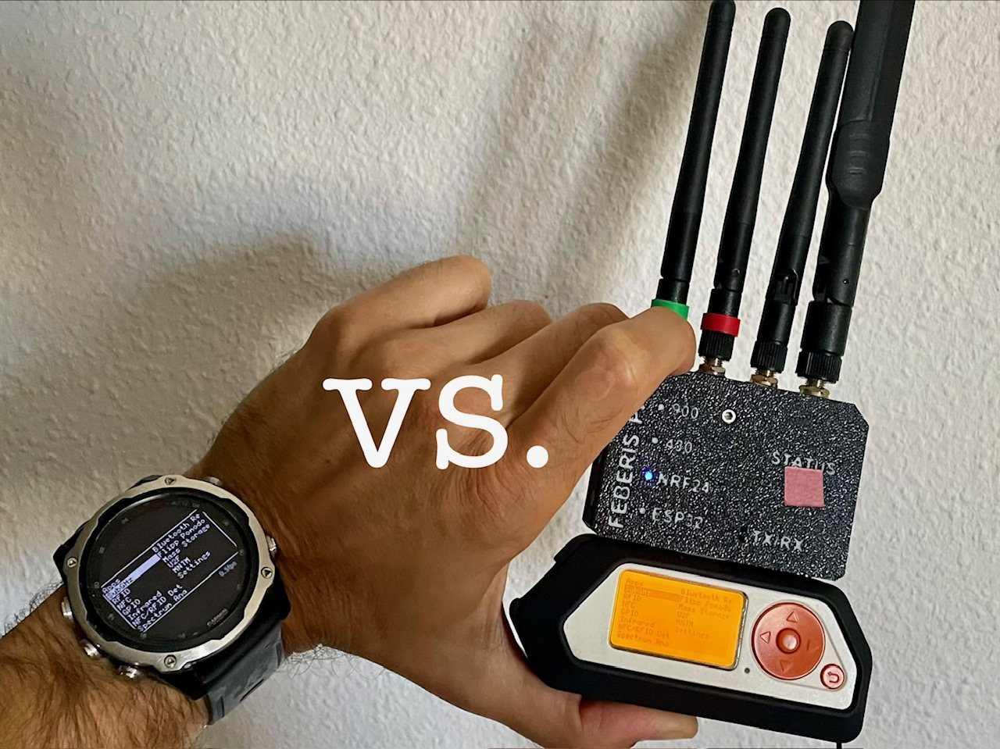
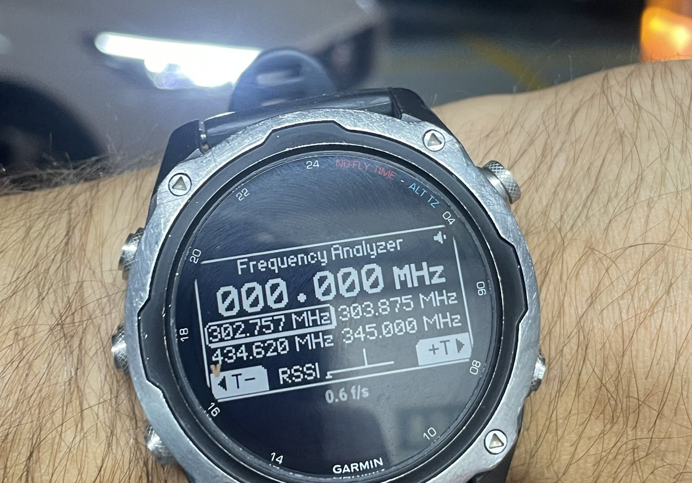

# Flipper Watch Remote

Drive a **Flipper Zero from a Garmin watch.** Use the watch buttons to control the Flipper.
The watch mirrors its screen over Bluetooth Low Energy. The Flipper can stay in a pocket or a
backpack while you use its own interface from your wrist.

## Why I made it

Flipper Zero is popular with hackers and hardware people for good reason.
During red team work, while diagnosing radio equipment in the field, or simply
experimenting, it can draw attention that has nothing to do with the task. People who do
not know it ask what it is; people who do know it can be even more curious.
Add accessories or antennas and the problem only gets louder, even when some of them are discreet.

I wanted a quieter way to use parts of it, so I made a Garmin app. I have used Momentum for years,
which is why the first firmware work is there. The project took me a while and came with a few
challenges. AI helped me get past some technical problems and move things along faster.

Using it from the watch is a trade: it is more discreet, but it is slower and less convenient. On
the tested Descent Mk2, the mirror runs at about 0.5fps, so do not expect a smooth screen. Button
presses can be noticeably delayed too. The command has to reach the Flipper, change its UI, and
return in a new screen frame. Input jumps ahead of screen data, but it can still wait for BLE work
already in flight. The project has no separate press-to-screen timing measurement.

The measured limit is the BLE transfer: one frame uses 52 acknowledged packets at the default MTU.
The renderer also has a watchdog limit and its own draw throttle, but the project does not show that
the watch CPU sets the observed frame rate.

## Two parts, one remote

| Part | Source | Job |
|---|---|---|
| Watch app | [`watchapp/`](watchapp/) | A Connect IQ / Monkey C app that scans, connects, renders the screen and sends input. |
| Firmware change | [`rz-x/Momentum-Firmware`](https://github.com/rz-x/Momentum-Firmware) on `feature/open-ble-pairing` | An opt-in setting that makes the existing Flipper RPC path reachable by this watch app. |

The watch is a BLE central. It talks to a custom GATT serial service, sends Flipper input events and
receives the composited screen framebuffer through the existing RPC protocol. There are no
per-feature watch screens: the watch shows the Flipper UI that is already running.

On five-button watches, UP/DOWN move on the selected axis, double-tap ENTER switches between the
vertical and horizontal axes, ENTER is OK, and BACK is BACK. Hold BACK for about 1.5 seconds to
leave the app. On touchscreen watches, swipe sends a direction and tap is OK.

## Device support

The full link has been tested on a **Garmin Descent Mk2** and a Flipper Zero running the patched
Momentum build. It mirrors correctly and sends all basic inputs.

Check [`docs/COMPATIBILITY.md`](docs/COMPATIBILITY.md) to see whether your Garmin may work.

## Firmware and BLE

This project needs its `feature/open-ble-pairing` Momentum build. Stock Momentum protects its
serial/RPC service with a bonded, authenticated Bluetooth LE link. The Descent Mk2 target cannot
make that secure bond from this Connect IQ app, so the patch adds an opt-in non-bonded path.

With **Momentum -> Protocols -> Open BLE Pairing** enabled, a new watch must be approved on the
Flipper before it can use RPC. Approval stores the watch's BLE address (up to eight devices); deny
closes the link before the service is available. **Forget BLE Remotes** clears that list.

This approval is not encryption. Screen contents and keystrokes are visible over the air, so leave
the setting off unless you are using the app. The connection, screen mirror and input have run on
hardware. The approval prompt and allowlist are build-verified and still need their own hardware
test. Read [`docs/KNOWN-ISSUES.md`](docs/KNOWN-ISSUES.md) before using the project.

The current [Momentum contribution policy](https://github.com/Next-Flip/Momentum-Firmware/blob/dev/CONTRIBUTING.md)
does not accept AI-assisted contributions. That is a practical obstacle to upstreaming this patch,
not a judgment on Momentum or its maintainers.

That surprised me, especially today. In my view, it may hurt the project by turning away many
other useful contributions.

For local builds and wire-layer tests, see [`watchapp/README.md`](watchapp/README.md). The deeper
record of the BLE work is in [`docs/PROJECT-JOURNAL.md`](docs/PROJECT-JOURNAL.md), and the draft
firmware proposal is in [`docs/UPSTREAM-PR.md`](docs/UPSTREAM-PR.md).

## What happens next

The plan is to test more watches, prepare an app package and submit it to the Connect IQ Store.
Submission is not a promise of publication: Garmin reviews each app before it appears in the store.

The more useful next step is official support in a Flipper firmware whose main branch can take it.
That would make the watch app much easier to use than a separate firmware build.

## Source and contributions

Both parts are available in source: the watch app is in this repository, and the firmware change is
in the linked Momentum fork. Help is welcome with hardware tests on named Garmin models, improving
screen refresh, reviewing the BLE approval path, and getting the app ready for store submission.

- Watch app: [Apache License 2.0](LICENSE), with [NOTICE](NOTICE).
- Firmware change: GPLv3 as a derivative of Momentum.
- Protocol definitions: [flipperzero-protobuf](https://github.com/flipperdevices/flipperzero-protobuf).
